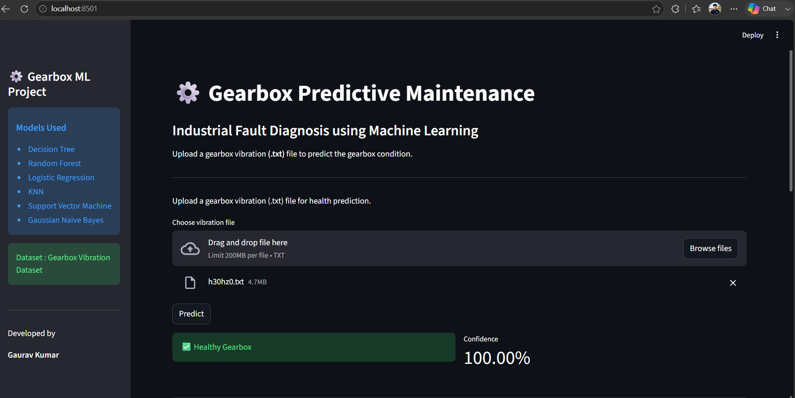
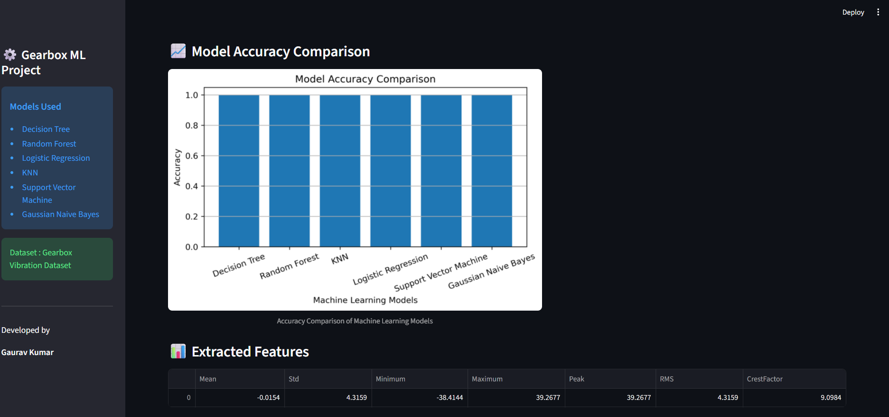
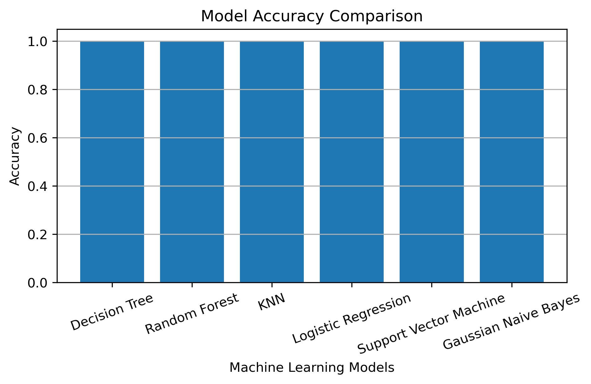

# ⚙️ Gearbox Predictive Maintenance using Machine Learning

## 📌 Overview

This project predicts the health condition of an industrial gearbox using **Machine Learning** and **vibration signal analysis**.

The system extracts statistical features from vibration signals stored in `.txt` files, trains multiple Machine Learning models, automatically selects the best-performing model, and predicts the condition of new gearbox vibration signals through a **Streamlit Web Application**.

---

# 🚀 Features

- 📂 Automatic Dataset Creation
- 📊 Statistical Feature Extraction
- 🧹 Data Preprocessing
- 🤖 Training Multiple Machine Learning Models
- 📈 Model Accuracy Comparison
- 📉 Confusion Matrix & Classification Report
- 🏆 Automatic Best Model Selection
- 💾 Save & Load Trained Model
- 🔍 Predict New Vibration Files
- 📱 Streamlit Web Application
- 📊 Confidence Score Prediction

---

# 🧠 Machine Learning Models

The following models are trained and compared:

- Decision Tree
- Random Forest
- K-Nearest Neighbors (KNN)
- Logistic Regression
- Support Vector Machine (SVM)
- Gaussian Naive Bayes

The model with the highest accuracy is automatically selected and saved.

---

# 📊 Features Extracted

Each vibration signal is converted into the following statistical features:

- Mean
- Standard Deviation
- Minimum
- Maximum
- Peak
- RMS (Root Mean Square)
- Crest Factor

---

# 📂 Project Structure

```text
Project_8_Gearbox_Predictive_Maintenance/

│
├── Dataset/
│   ├── Healthy Data/
│   └── BrokenTooth Data/
│
├── Docs/
│
├── Images/
│
├── Models/
│   └── Gearbox_model.pkl
│
├── Outputs/
│   └── Gearbox_features.csv
│
├── Reports/
│
├── src/
│   ├── config.py
│   ├── feature_extraction.py
│   ├── preprocess.py
│   ├── train_model.py
│   ├── evaluate_model.py
│   ├── save_model.py
│   ├── load_model.py
│   ├── predict_model.py
│   └── utils.py
│
├── app.py
├── main.py
├── requirements.txt
├── README.md
└── .gitignore
```

---

# 📁 Dataset

The dataset consists of vibration signals collected from:

- ✅ Healthy Gearbox
- ❌ Broken Tooth Gearbox

Each vibration signal is stored as a `.txt` file.

The statistical features are extracted automatically before model training.

---

# 💻 Technologies Used

- Python
- NumPy
- Pandas
- Matplotlib
- Scikit-Learn
- Joblib
- Streamlit

---

# ⚙️ Installation

## Clone Repository

```bash
git clone https://github.com/gauravkumar902704/Project_8_Gearbox_Predictive_Maintenance.git
```

## Move into Project Folder

```bash
cd Project_8_Gearbox_Predictive_Maintenance
```

## Install Dependencies

```bash
pip install -r requirements.txt
```

---

# ▶️ Run Training Pipeline

```bash
python main.py
```

---

# 🌐 Run Streamlit App

```bash
streamlit run app.py
```

---

# 📈 Output

The project provides:

- Dataset Creation
- Feature Extraction
- Model Training
- Model Comparison
- Accuracy Comparison Graph
- Confusion Matrix
- Classification Report
- Best Model Selection
- Saved ML Model
- Gearbox Health Prediction
- Confidence Score
- Streamlit Dashboard

---
## 🚀 Live Application

🌐 **Live Demo:**  
https://gauravkumar902704-project-8-gearbox-predictive-maint-app-lkj6bq.streamlit.app/

📂 **GitHub Repository:**  
https://github.com/gauravkumar902704/Project_8_Gearbox_Predictive_Maintenance

# 📸 Project Screenshots
## 📸 Project Screenshots

### Streamlit Dashboard




---

### Accuracy Comparison



## Streamlit Dashboard

> Add your Streamlit dashboard screenshot here.

```text
Images/dashboard.png
```

---

## Accuracy Comparison

> Add your generated graph here.

```text
Images/accuracy_comparison.png
```

---

# 🔮 Future Improvements

- Deep Learning (CNN / LSTM)
- Real-time Sensor Integration
- IoT-Based Predictive Maintenance
- Cloud Deployment
- REST API using FastAPI
- Docker Deployment
- Industrial Dashboard

---

# 👨‍💻 Author

## Gaurav Kumar

**B.Tech – Information Technology**

### GitHub

https://github.com/gauravkumar902704

### LinkedIn

https://www.linkedin.com/in/gaurav-kumar-a756a1278

---

# ⭐ Support

If you found this project useful, please consider giving it a ⭐ on GitHub.

---

## 📜 License

This project is developed for educational and learning purposes.